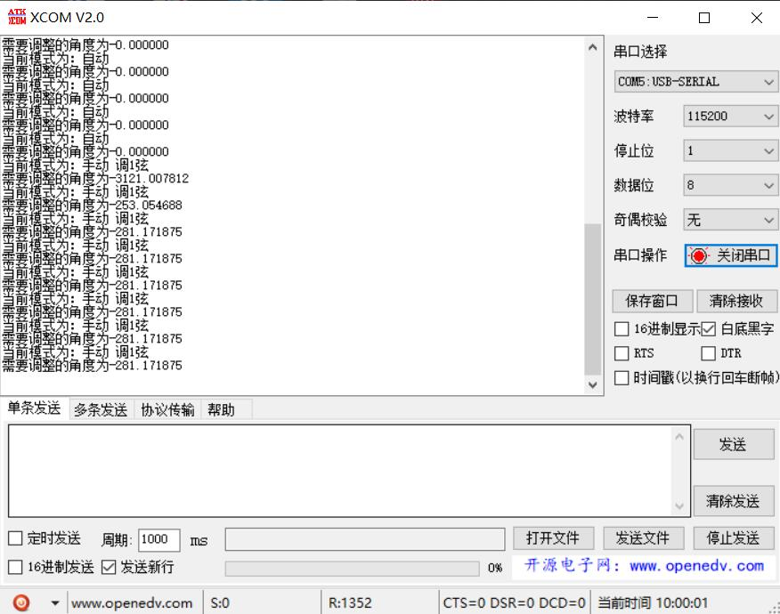
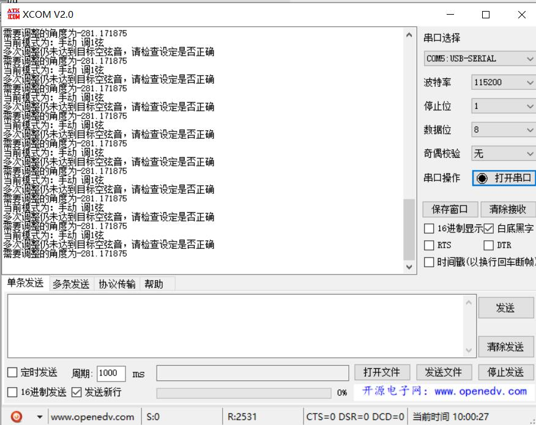
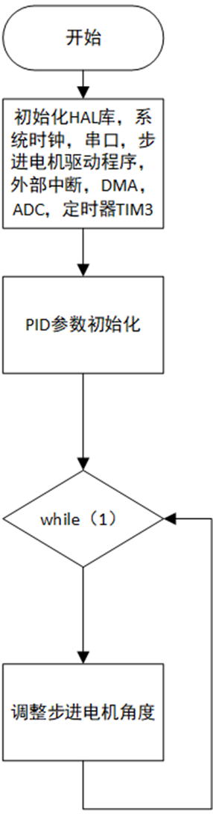
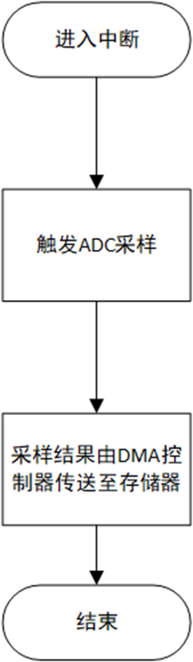
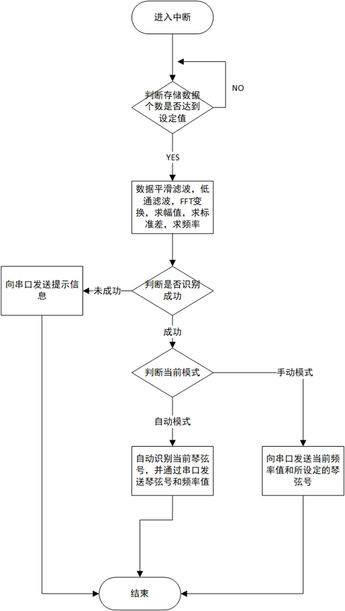

# Guitar-Tuner
An audio detection/tuner system based on STM32F7

# 基于 STM32F767 的智能吉他调音器

> 天津大学电气自动化与信息工程学院  
> 课程设计 · 2022 年 5 月

---

## 项目背景
民谣吉他在不同温湿度环境下琴颈伸缩，导致琴弦音高失准。传统手动调弦既繁琐又难以保证精度。本项目利用 **STM32F767**（ARM Cortex-M7）构建自动调音器：  
- 通过压电陶瓷传感器采集琴弦振动信号  
- 经 FFT 频谱分析提取基频  
- 以增量式 PID 控制步进电机旋转琴钮，实现琴弦松紧的闭环调节  
- 支持自动 / 手动两种模式，并可通过串口实时查看频率数据

---

## 硬件设计

### 1. 主控平台
- **MCU**：STM32F767IGT6，200 MHz，双精度 FPU，DSP 指令集  
- **开发板**：ALIENTEK 阿波罗 STM32F767（集成 USB-TTL、按键、调试接口等）

### 2. 信号采集
- **传感器**：模拟压电陶瓷片  
- **接口**：PA5 → ADC1 Channel 5  
- **采样**：TIM3 触发，1.8 MSPS，DMA 自动搬运 4096 点

### 3. 执行机构
- **电机**：28BYJ-48 五线四相步进电机（减速比 1/64，步距角 5.625°）  
- **驱动**：ULN2003 达林顿阵列，1-2 相励磁  
- **接口**：GPIO 直接输出换相信号

### 4. 人机交互
- **按键**：KEY0~KEY2 + KEY_UP（共 4 个，外部中断）  
- **通信**：USART1 → CH340G → USB（Mini-USB 供电 + 数据）

---

## 软件设计

| 模块 | 关键实现 |
|---|---|
| **ADC 采样** | TIM3 溢出触发 ADC1 → DMA2 Stream0 搬运 4096 点 |
| **数字滤波** | 4 点滑动平均 + 低通，保留 0–350 Hz |
| **频谱分析** | CMSIS-DSP `arm_cfft_radix4_f32` + 求模 |
| **频率提取** | 取幅值最大 bin → 计算实际频率 |
| **PID 控制** | 增量式 Δu(k) = Kp·e(k-1) + Ki·e(k) + Kd·[e(k)-2e(k-1)+e(k-2)] |
| **电机驱动** | TIM4 产生步进脉冲，查表法换相 |
| **模式切换** | 外部中断实时响应，支持自动 / 手动 / 弦号选择 |
| **数据回传** | USART1 打印当前频率、目标频率、误差 |

---

## 测试结果

| 模式 | 功能验证 |
|---|---|
| **自动** | 空弦音偏离 ≤ 1.5 个半音时可自动识别并调至标准音高 |
| **手动** | 任意选择琴弦，即使完全松弦也能逐步调至标准 |
| **异常提示** | 多次调整仍未达标时串口输出警告信息 |

>   
>   
> 

---

## 流程图
**主程序**
> 

**定时器中断**
> 

**DMA中断**
> 

---
